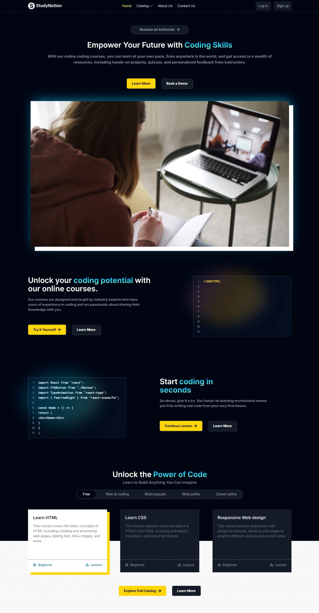
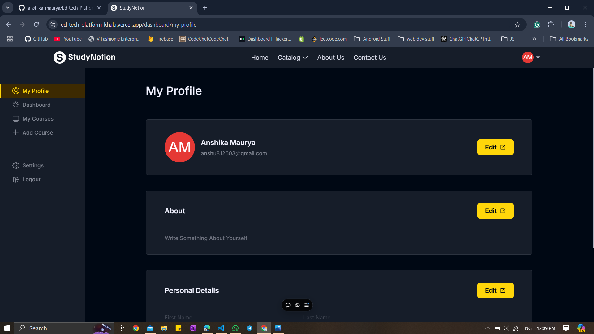
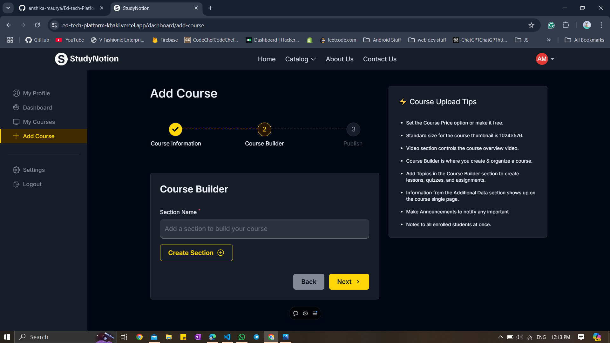
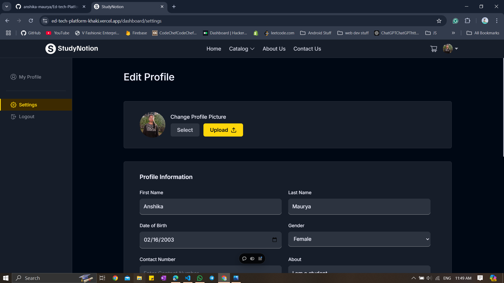
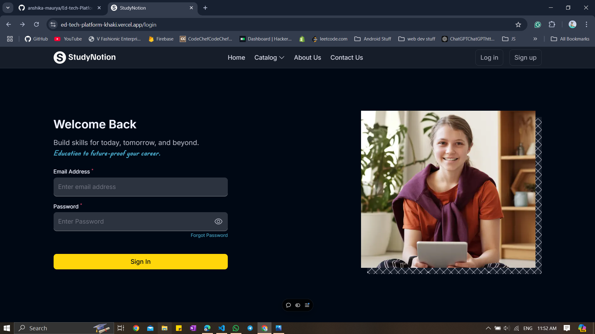
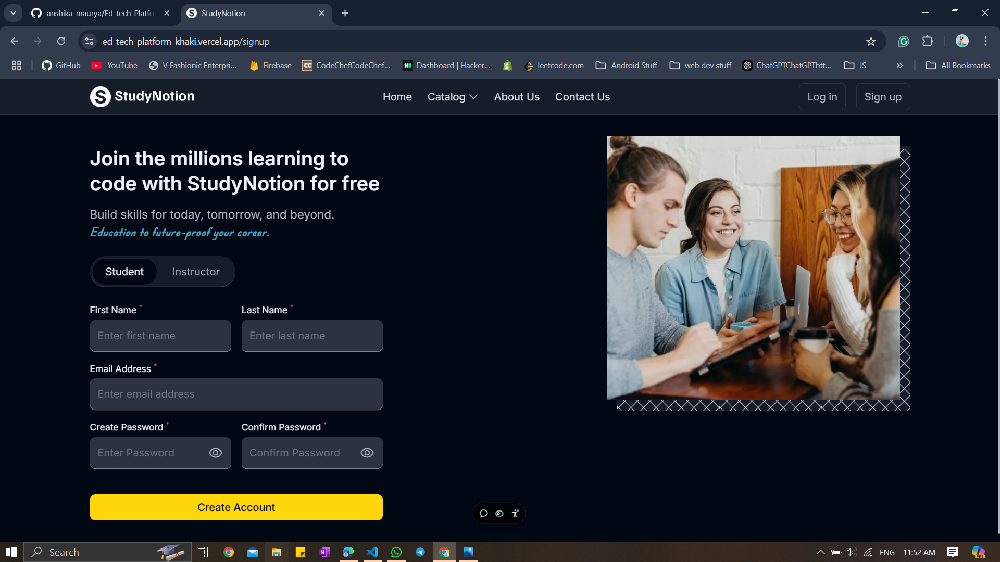
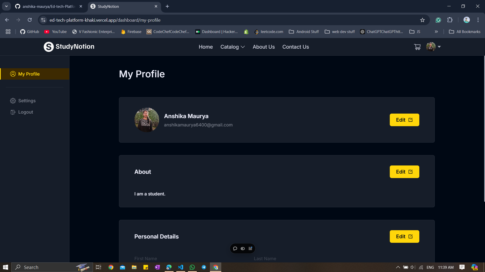
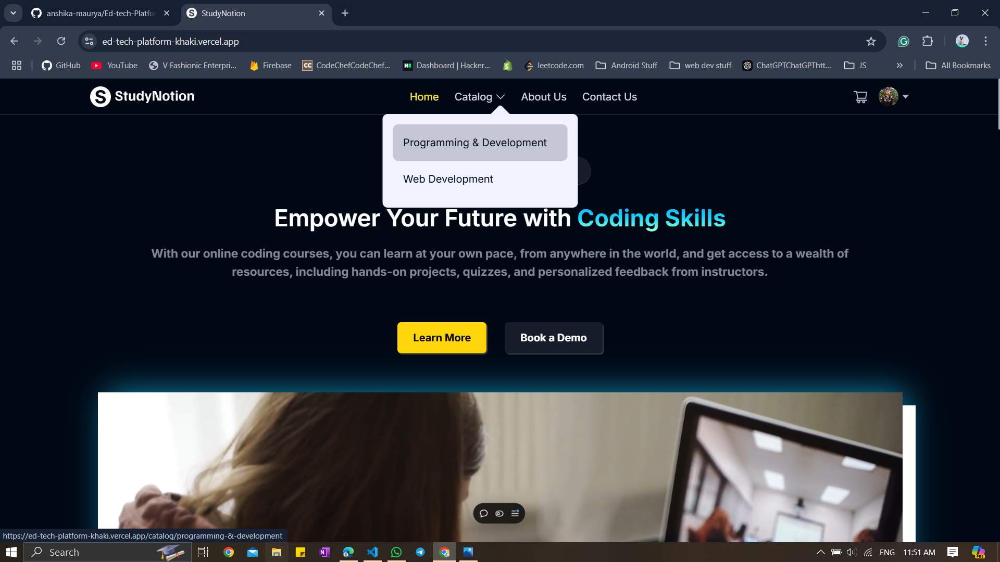
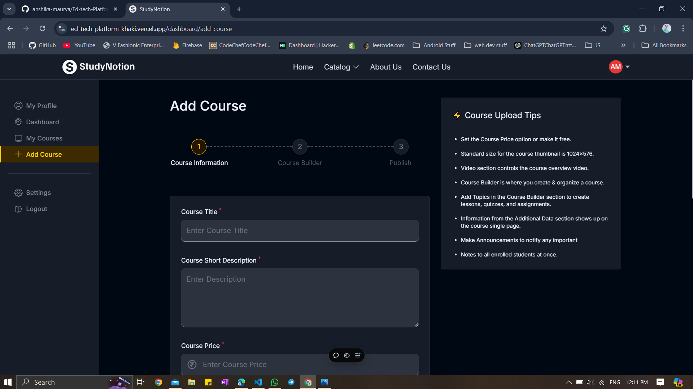
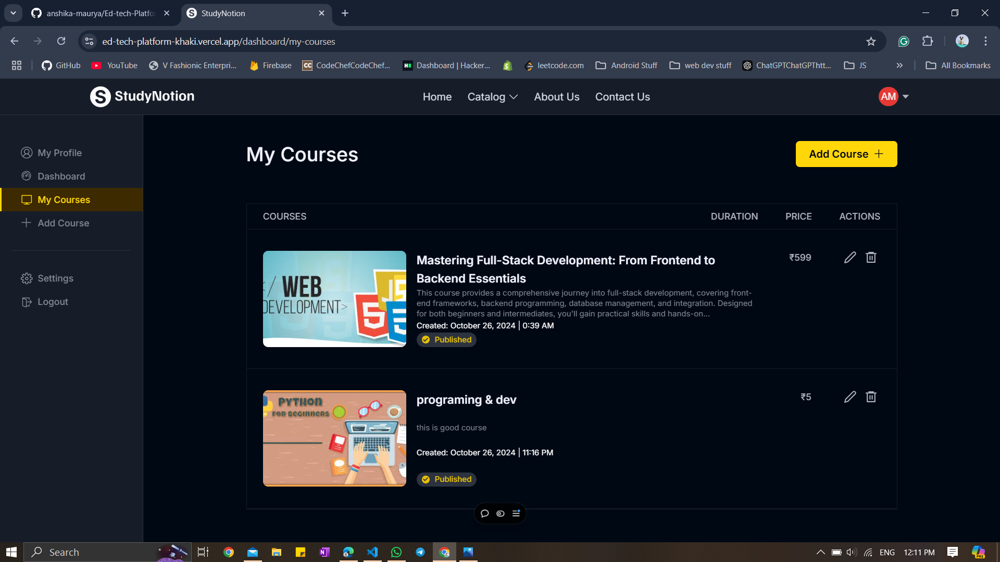

# <div align="center">🚀 **StudyNotion** - *A Modern Ed-Tech Platform* 🎓</div>

<div align="center">
  
  <br><br>
  
  [](https://vercel.com/)
  [](https://www.mongodb.com/)
  [](https://expressjs.com/)
  [](https://reactjs.org/)
  [](https://nodejs.org/)
  [](https://tailwindcss.com/)
</div>

<p align="center">
  StudyNotion is a feature-rich, full-stack educational platform that enables users to create, access, and rate various educational courses. Built on the powerful MERN stack, it provides an engaging learning experience for students and a productive teaching environment for instructors.
</p>

---

## <div align="center">✨ **Key Features** ✨</div>

<table>
  <tr>
    <td width="50%">
      <h3 align="center">📚 For Students</h3>
      <ul>
        <li>Browse and filter courses by category</li>
        <li>Purchase courses with secure Razorpay integration</li>
        <li>Watch course content with video player</li>
        <li>Track learning progress on dashboard</li>
        <li>Rate and review purchased courses</li>
      </ul>
    </td>
    <td width="50%">
      <h3 align="center">👨‍🏫 For Instructors</h3>
      <ul>
        <li>Create and manage courses</li>
        <li>Add course content with rich media support</li>
        <li>View course statistics and earnings</li>
        <li>Analyze student engagement</li>
        <li>Edit course details and content</li>
      </ul>
    </td>
  </tr>
</table>

---

## <div align="center">📸 **Screenshots Gallery** 📸</div>

<div align="center">
  <h3>🎬 Interactive Screenshot Carousel</h3>
  
  <table align="center" border="0">
    <tr>
      <td align="center">
        <a href="#slide1">
          
        </a>
      </td>
      <td align="center">
        <a href="#slide2">
          
        </a>
      </td>
      <td align="center">
        <a href="#slide3">
          
        </a>
      </td>
      <td align="center">
        <a href="#slide4">
          
        </a>
      </td>
    </tr>
  </table>
  
  <table align="center" border="0">
    <tr>
      <td width="22%" align="center">
        <a href="#slide1"></a>
      </td>
      <td width="22%" align="center">
        <a href="#slide2"></a>
      </td>
      <td width="22%" align="center">
        <a href="#slide3"></a>
      </td>
      <td width="22%" align="center">
        <a href="#slide4"></a>
      </td>
    </tr>
  </table>
  
  <div id="slide1">
    <h3>🏠 Homepage</h3>
    
    <p align="center"><i>Beautiful, responsive landing page with course highlights and featured categories</i></p>
  </div>
  
  <div id="slide2">
    <h3>📊 Instructor Dashboard</h3>
    
    <p align="center"><i>Powerful analytics and course management tools for instructors</i></p>
  </div>
  
  <div id="slide3">
    <h3>📝 Course Builder</h3>
    
    <p align="center"><i>Intuitive interface for creating and organizing course content</i></p>
  </div>
  
  <div id="slide4">
    <h3>⚙️ Profile Settings</h3>
    
    <p align="center"><i>User-friendly profile management and account settings</i></p>
  </div>
  
  <br>
  
  <details>
    <summary><b>🖼️ View Additional Screenshots</b></summary>
    <br>
    <h3>🔐 Authentication Screens</h3>
    <p float="left">
      
      
    </p>
    <br>
    <h3>👨‍🎓 Student Experience</h3>
    <p float="left">
      
      
    </p>
    <br>
    <h3>👨‍🏫 Course Management</h3>
    <p float="left">
      
      
    </p>
  </details>
</div>

<br>

<div align="center">
  <a href="https://educational-platform-16.vercel.app/" target="_blank">
    
  </a>
</div>

---

## <div align="center">🏗️ **System Architecture** 🏗️</div>

<div align="center">
  
</div>

<p align="center">
  The <b>StudyNotion</b> platform adopts a client-server architecture with three main components:
</p>

<table>
  <tr>
    <td width="33%" align="center">
      <h3>🖥️ Frontend</h3>
      <p>ReactJS, Tailwind CSS</p>
      <p>Responsive UI, Redux state management</p>
    </td>
    <td width="33%" align="center">
      <h3>⚙️ Backend</h3>
      <p>Node.js, Express</p>
      <p>JWT Auth, API endpoints</p>
    </td>
    <td width="33%" align="center">
      <h3>🗄️ Database</h3>
      <p>MongoDB Atlas</p>
      <p>NoSQL, flexible schema</p>
    </td>
  </tr>
</table>

---

## <div align="center">💡 **Technical Highlights** 💡</div>

<div align="center">
  
</div>

### Key Technical Features

- **🔒 Authentication & Authorization**: Secure user authentication with JWT and bcrypt
- **💳 Payment Integration**: Seamless payment processing with Razorpay
- **🖼️ Media Storage**: Efficient media management with Cloudinary
- **📱 Responsive Design**: Fully responsive UI for all device sizes
- **🧩 Modular Architecture**: Well-organized codebase with reusable components
- **🔄 State Management**: Global state management with Redux Toolkit

---

## <div align="center">🚀 **Deployment** 🚀</div>

StudyNotion is deployed on scalable, cloud-based platforms:

<table align="center">
  <tr>
    <td align="center">
      
    </td>
    <td align="center">
      
    </td>
  </tr>
  <tr>
    <td align="center">
      
    </td>
    <td align="center">
      
    </td>
  </tr>
</table>

---

## <div align="center">🧩 **Getting Started** 🧩</div>

### Prerequisites
- Node.js (v14 or above)
- MongoDB account
- Cloudinary account
- Razorpay account for payment integration

### Installation

1. **Clone the Repository**
   ```bash
   git clone [your-repository-url]
   ```

2. **Frontend Setup**
   ```bash
   cd StudyNotion
   npm install
   npm start
   ```

3. **Backend Setup**
   ```bash
   cd server
   npm install
   npm run dev
   ```

4. **Environment Variables**

   Create a `.env` file in the server directory with:
   ```
   MONGODB_URL=your_mongodb_connection_string
   CLOUDINARY_CLOUD_NAME=your_cloudinary_cloud_name
   CLOUDINARY_API_KEY=your_cloudinary_api_key
   CLOUDINARY_API_SECRET=your_cloudinary_api_secret
   RAZORPAY_KEY_ID=your_razorpay_key_id
   RAZORPAY_SECRET=your_razorpay_secret
   JWT_SECRET=your_jwt_secret
   ```

---

## <div align="center">🤝 **Contributing** 🤝</div>

We welcome contributions to make StudyNotion even better! Please follow these steps:

1. Fork the repository
2. Create your feature branch (`git checkout -b feature/amazing-feature`)
3. Commit your changes (`git commit -m 'Add some amazing feature'`)
4. Push to the branch (`git push origin feature/amazing-feature`)
5. Open a Pull Request

---

## <div align="center">📄 **License** 📄</div>

<p align="center">
  This project is licensed under the MIT License - see the <a href="LICENSE">LICENSE</a> file for details.
</p>

---

<div align="center">
  <h3>💻 With StudyNotion, we're committed to revolutionizing online education 📚</h3>
  <p>Making learning accessible, interactive, and impactful!</p>
  <br>
  <p>
    <a href="https://educational-platform-16.vercel.app/">
      
    </a>
  </p>
</div> 